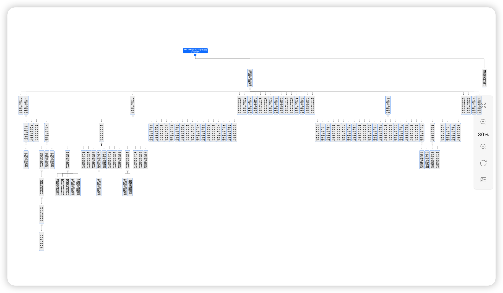

## HTML 及 VueCli 实现股权结构图生成

依赖于 [relation-graph](https://www.relation-graph.com/) 关系数据展示组件

### HTML 形式实现

直接打开 /graph2.html 文件，即展示股权结构图




### VueCli 形式实现

进入脚手架项目路径

```sh
cd tree_relation_graph
```

初始化

```sh
npm i
```

启动项目

```sh
npm run TreeRelationGraphServe
```

构建项目

```sh
npm run TreeRelationGraphBuild
```


#### Axios 远程获取数据

启动后端数据：[Node 后端数据](https://github.com/YuncenLiu/vue-basic/tree/master/node#node-%E5%90%AF%E5%8A%A8%E6%96%B9%E5%BC%8F)

访问 [http://localhost:5003/node](http://localhost:5003/node) 、 [http://localhost:5003/link](http://localhost:5003/link) 可以获取数据后，通过配置的 `vue.config.js` 代理实现数据访问

```js
devServer: {
        proxy: {
            '/api': {
                target: 'http://localhost:5003',
                ws: true,
                changeOrigin: true,
                pathRewrite: {'^/api': ''}
            }
        }
    }
```

实现效果图入 HTML 一致
